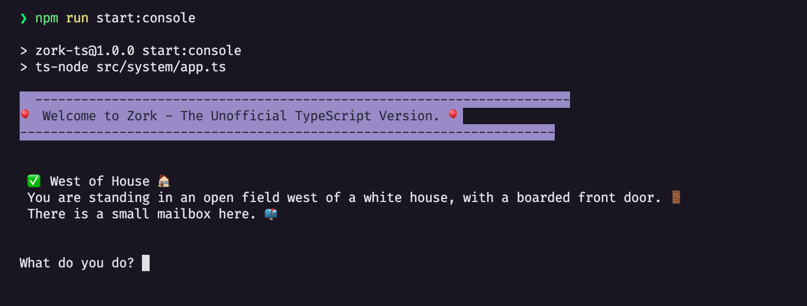
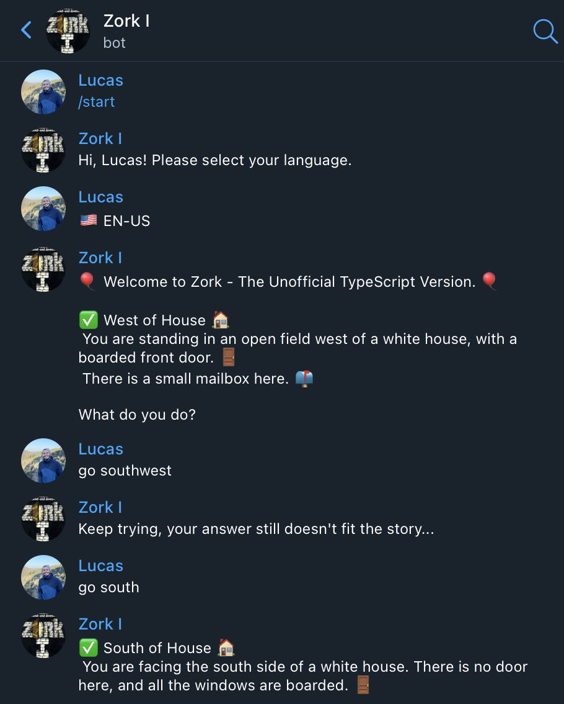

# Zork - Unofficial TypeScript Version

<div align="center">
	
</div>
<br>
<div align="center">
	
	
	
	
	<a href="https://open.vscode.dev/lucasluizss/zork-ts">
	    
	</a>
	<a href="https://GitHub.com/lucasluizss/zork-ts/stargazers/">
	    
	</a>
</div>
<hr>

Zork was directly inspired by the first text adventure game, Colossal Cave Adventure, written in 1975. Zork distinguished itself in its genre as an especially rich game, in terms of both the quality of the storytelling and the sophistication of its text parser, which was not limited to simple verb-noun commands ("hit troll"), but recognized some prepositions and conjunctions ("hit the troll with the Elvish sword"). \
[Source](https://en.wikipedia.org/wiki/Zork)

## :gear: Setup

### :chains: Requirements

- [nodejs](https://nodejs.org/en/download/)

### :paperclips: Installing dependencies

First of all you need to install the dependencies running the command below in your terminal:

```shell
cd zork-ts
npm install
```

## :running: Running

### :key: Bot Environment

```shell
BOT_TOKEN=secret-value
CHAT_ID=secret-value
MAP_URI=secret-value
USER_MAXIMUM_ATTEMPTS=secret-value
```

### :desktop_computer: Console Execution

```shell
npm start:console
```



### :robot: Play with Telegram bot

[Try the bot using this link](https://t.me/ZorkFirstBot) or search for `@ZorkFirstBot`.



### :sparkles: Executing console with a selected language

#### :globe_with_meridians: Supported Languages

|   Flag   |  Language  | Code |
| :------: | :--------: | :--: |
|   :us:   |  English   |  en  |
| :brazil: | Portuguese |  pt  |

`e.g.`:

```shell
npm start:console -lang pt
```

or

```shell
npm start:console --lang=pt
```

## :bust_in_silhouette: Author

<p align="center">
	Made with ♥ by <a href="https://www.linkedin.com/in/lucasluizss/" target="_blank">Lucas Silva</a>
</p>
<p align="center">
	<a href="https://lucasluizss.github.io" target="_blank" >
		
	</a>&nbsp;&nbsp;&nbsp;
	<a href="https://www.linkedin.com/in/lucasluizss/" target="_blank" >
		
	</a>&nbsp;&nbsp;&nbsp;
	<a href="mailto:lucasluizss@live.com" target="_blank" >
		
	</a>
</p>
